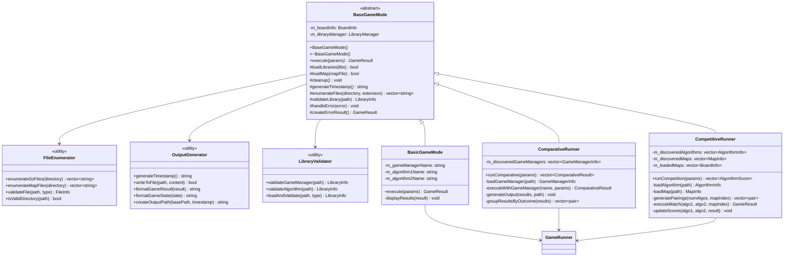

# Game Modes Refactoring Plan

## Overview

This document outlines a comprehensive refactoring plan to eliminate code duplication between the game mode classes (`BasicGameMode`, `ComparativeRunner`, `CompetitiveRunner`) and improve the overall design architecture.

## Current Issues

### Code Duplication Analysis

1. **Library Loading Logic** (~80% duplication)
   - Similar library loading, validation, and cleanup patterns across all classes
   - Repeated error handling for library operations
   - Identical cleanup methods

2. **File Enumeration** (~70% duplication)
   - Similar file scanning logic in `ComparativeRunner` and `CompetitiveRunner`
   - Repeated filesystem error handling
   - Duplicate file validation logic

3. **Output Generation** (~60% duplication)
   - Similar timestamp generation methods
   - Repeated file output patterns
   - Duplicate error reporting logic

4. **Error Handling** (~90% duplication)
   - Identical try-catch patterns
   - Similar error result creation
   - Repeated cleanup calls

## Proposed Architecture



## Implementation Plan

### Phase 1: Create Utility Classes

#### Step 1.1: Create FileEnumerator Utility
**File**: `Simulator/utils/file_enumerator.h` and `Simulator/utils/file_enumerator.cpp`

```cpp
// file_enumerator.h
#pragma once
#include <string>
#include <vector>
#include <filesystem>

struct FileInfo {
    std::string path;
    std::string name;
    bool valid;
    std::string error;
};

class FileEnumerator {
public:
    static std::vector<std::string> enumerateSoFiles(const std::string& directory);
    static std::vector<std::string> enumerateMapFiles(const std::string& directory);
    static FileInfo validateFile(const std::string& path, const std::string& type);
    static bool isValidDirectory(const std::string& path);
    
private:
    static std::vector<std::string> enumerateFilesByExtension(
        const std::string& directory, 
        const std::string& extension
    );
};
```

**Tasks**:
- [ ] Create header file with FileInfo struct and FileEnumerator class
- [ ] Implement file enumeration methods
- [ ] Add directory validation
- [ ] Add file validation logic
- [ ] Write unit tests for FileEnumerator

#### Step 1.2: Create OutputGenerator Utility
**File**: `Simulator/utils/output_generator.h` and `Simulator/utils/output_generator.cpp`

```cpp
// output_generator.h
#pragma once
#include <string>
#include <chrono>
#include "common/GameResult.h"
#include "common/SatelliteView.h"

class OutputGenerator {
public:
    static std::string generateTimestamp();
    static bool writeToFile(const std::string& path, const std::string& content);
    static std::string formatGameResult(const GameResult& result);
    static std::string formatGameState(const SatelliteView& state, int rows, int cols);
    static std::string createOutputPath(const std::string& basePath, const std::string& timestamp);
    
private:
    static std::string formatTimestamp(const std::chrono::system_clock::time_point& time);
};
```

**Tasks**:
- [ ] Create header file with OutputGenerator class
- [ ] Implement timestamp generation
- [ ] Implement file writing utilities
- [ ] Add game result formatting
- [ ] Add game state formatting
- [ ] Write unit tests for OutputGenerator

#### Step 1.3: Create LibraryValidator Utility
**File**: `Simulator/utils/library_validator.h` and `Simulator/utils/library_validator.cpp`

```cpp
// library_validator.h
#pragma once
#include <string>
#include "utils/library_manager.h"
#include "registration/GameManagerRegistrar.h"
#include "registration/AlgorithmRegistrar.h"

struct LibraryInfo {
    std::string path;
    std::string name;
    bool loaded;
    std::string error;
};

class LibraryValidator {
public:
    static LibraryInfo validateGameManager(const std::string& path);
    static LibraryInfo validateAlgorithm(const std::string& path);
    static LibraryInfo loadAndValidate(const std::string& path, const std::string& type);
    
private:
    static LibraryInfo validateLibrary(const std::string& path, const std::string& type);
    static void cleanupOnError();
};
```

**Tasks**:
- [ ] Create header file with LibraryInfo struct and LibraryValidator class
- [ ] Implement GameManager validation
- [ ] Implement Algorithm validation
- [ ] Add generic library validation
- [ ] Add error cleanup logic
- [ ] Write unit tests for LibraryValidator

### Phase 2: Create BaseGameMode Abstract Class

#### Step 2.1: Create BaseGameMode Header
**File**: `Simulator/game_modes/base_game_mode.h`

```cpp
// base_game_mode.h
#pragma once
#include <string>
#include <memory>
#include "common/GameResult.h"
#include "utils/file_loader.h"
#include "utils/library_manager.h"

class BaseGameMode {
public:
    BaseGameMode();
    virtual ~BaseGameMode();
    
    // Template method pattern - defines the algorithm structure
    GameResult execute(const Parameters& params);
    
protected:
    // Abstract methods that subclasses must implement
    virtual bool loadLibraries(const Parameters& params) = 0;
    virtual bool loadMap(const std::string& mapFile) = 0;
    virtual GameResult executeGameLogic(const Parameters& params) = 0;
    virtual void displayResults(const GameResult& result) = 0;
    
    // Common utility methods available to subclasses
    void cleanup();
    std::string generateTimestamp() const;
    std::vector<std::string> enumerateFiles(const std::string& directory, const std::string& extension);
    LibraryInfo validateLibrary(const std::string& path);
    void handleError(const std::string& error);
    GameResult createErrorResult() const;
    
    // Protected member variables
    FileLoader::BoardInfo m_boardInfo;
    std::unique_ptr<LibraryManager> m_libraryManager;
    
private:
    // Common implementation details
    bool performCommonSetup(const Parameters& params);
    void performCommonCleanup();
};
```

**Tasks**:
- [ ] Create header file with BaseGameMode class
- [ ] Define abstract interface methods
- [ ] Add common utility methods
- [ ] Add protected member variables
- [ ] Define Parameters struct (to be determined based on common needs)

#### Step 2.2: Create BaseGameMode Implementation
**File**: `Simulator/game_modes/base_game_mode.cpp`

```cpp
// base_game_mode.cpp
#include "base_game_mode.h"
#include "utils/file_enumerator.h"
#include "utils/output_generator.h"
#include "utils/library_validator.h"
#include <iostream>

BaseGameMode::BaseGameMode() 
    : m_libraryManager(std::make_unique<LibraryManager>()) {
}

BaseGameMode::~BaseGameMode() {
    cleanup();
}

GameResult BaseGameMode::execute(const Parameters& params) {
    GameResult result;
    
    try {
        // Common setup
        if (!performCommonSetup(params)) {
            return createErrorResult();
        }
        
        // Load libraries (subclass responsibility)
        if (!loadLibraries(params)) {
            handleError("Failed to load libraries");
            return createErrorResult();
        }
        
        // Load map (subclass responsibility)
        if (!loadMap(params.mapFile)) {
            handleError("Failed to load map");
            return createErrorResult();
        }
        
        // Execute game logic (subclass responsibility)
        result = executeGameLogic(params);
        
        // Display results (subclass responsibility)
        if (params.verbose) {
            displayResults(result);
        }
        
    } catch (const std::exception& e) {
        handleError("Exception during execution: " + std::string(e.what()));
        result = createErrorResult();
    } catch (...) {
        handleError("Unknown exception during execution");
        result = createErrorResult();
    }
    
    performCommonCleanup();
    return result;
}

// Implementation of common utility methods...
```

**Tasks**:
- [ ] Implement template method pattern in execute()
- [ ] Implement common utility methods
- [ ] Add error handling and cleanup logic
- [ ] Integrate with utility classes
- [ ] Write unit tests for BaseGameMode

### Phase 3: Refactor Existing Game Mode Classes

#### Step 3.1: Refactor BasicGameMode
**Tasks**:
- [ ] Update BasicGameMode to inherit from BaseGameMode
- [ ] Remove duplicated code (library loading, cleanup, error handling)
- [ ] Implement abstract methods from BaseGameMode
- [ ] Update constructor and destructor
- [ ] Remove redundant member variables
- [ ] Update tests to work with new inheritance structure

**Changes**:
```cpp
// basic_game_mode.h
#pragma once
#include "base_game_mode.h"

class BasicGameMode : public BaseGameMode {
public:
    BasicGameMode() = default;
    ~BasicGameMode() = default;

    struct GameParameters {
        std::string mapFile;
        std::string gameManagerLib;
        std::string algorithm1Lib;
        std::string algorithm2Lib;
        bool verbose = true;
    };

protected:
    // Implement abstract methods from BaseGameMode
    bool loadLibraries(const Parameters& params) override;
    bool loadMap(const std::string& mapFile) override;
    GameResult executeGameLogic(const Parameters& params) override;
    void displayResults(const GameResult& result) override;

private:
    std::string m_gameManagerName;
    std::string m_algorithm1Name;
    std::string m_algorithm2Name;
};
```

#### Step 3.2: Refactor ComparativeRunner
**Tasks**:
- [ ] Update ComparativeRunner to inherit from BaseGameMode
- [ ] Remove duplicated code (file enumeration, library loading, cleanup)
- [ ] Implement abstract methods from BaseGameMode
- [ ] Keep ComparativeRunner-specific logic (result grouping, output formatting)
- [ ] Update tests

**Changes**:
```cpp
// comparative_runner.h
#pragma once
#include "base_game_mode.h"
#include <vector>
#include <chrono>

class ComparativeRunner : public BaseGameMode {
public:
    ComparativeRunner() = default;
    ~ComparativeRunner() = default;

    struct ComparativeParameters {
        std::string gameManagersFolder;
        std::string mapFile;
        std::string algorithm1Lib;
        std::string algorithm2Lib;
        bool verbose = true;
    };

    std::vector<ComparativeResult> runComparative(const ComparativeParameters& params);

protected:
    // Implement abstract methods from BaseGameMode
    bool loadLibraries(const Parameters& params) override;
    bool loadMap(const std::string& mapFile) override;
    GameResult executeGameLogic(const Parameters& params) override;
    void displayResults(const GameResult& result) override;

private:
    // ComparativeRunner-specific methods
    GameManagerInfo loadGameManager(const std::string& soPath);
    ComparativeResult executeWithGameManager(const std::string& gameManagerName, const ComparativeParameters& params);
    void generateOutput(const std::vector<ComparativeResult>& results, const std::string& outputPath, const ComparativeParameters& params);
    std::vector<std::pair<std::vector<std::string>, const ComparativeResult*>> groupResultsByOutcome(const std::vector<ComparativeResult>& results);
    
    std::vector<GameManagerInfo> m_discoveredGameManagers;
};
```

#### Step 3.3: Refactor CompetitiveRunner
**Tasks**:
- [ ] Update CompetitiveRunner to inherit from BaseGameMode
- [ ] Remove duplicated code (file enumeration, library loading, cleanup)
- [ ] Implement abstract methods from BaseGameMode
- [ ] Keep CompetitiveRunner-specific logic (pairing generation, score tracking)
- [ ] Update tests

**Changes**:
```cpp
// competitive_runner.h
#pragma once
#include "base_game_mode.h"
#include <vector>
#include <unordered_map>

class CompetitiveRunner : public BaseGameMode {
public:
    CompetitiveRunner() = default;
    ~CompetitiveRunner() = default;

    struct CompetitiveParameters {
        std::string gameMapsFolder;
        std::string gameManagerLib;
        std::string algorithmsFolder;
        bool verbose = true;
    };

    std::vector<AlgorithmScore> runCompetition(const CompetitiveParameters& params);

protected:
    // Implement abstract methods from BaseGameMode
    bool loadLibraries(const Parameters& params) override;
    bool loadMap(const std::string& mapFile) override;
    GameResult executeGameLogic(const Parameters& params) override;
    void displayResults(const GameResult& result) override;

private:
    // CompetitiveRunner-specific methods
    AlgorithmInfo loadAlgorithm(const std::string& soPath);
    MapInfo loadMap(const std::string& mapPath);
    std::vector<std::pair<int, int>> generatePairings(int numAlgorithms, int mapIndex);
    GameResult executeMatch(int algorithm1Index, int algorithm2Index, int mapIndex, const CompetitiveParameters& params);
    void updateScores(int algorithm1Index, int algorithm2Index, const GameResult& result, std::unordered_map<int, AlgorithmScore>& scores);
    void generateOutput(const std::vector<AlgorithmScore>& scores, const std::string& outputPath, const CompetitiveParameters& params);
    
    std::vector<AlgorithmInfo> m_discoveredAlgorithms;
    std::vector<MapInfo> m_discoveredMaps;
    std::vector<FileLoader::BoardInfo> m_loadedMaps;
    std::string m_gameManagerName;
};
```

### Phase 4: Remove Duplicated Code and Update Tests

#### Step 4.1: Code Cleanup
**Tasks**:
- [ ] Remove duplicated library loading code from all game mode classes
- [ ] Remove duplicated file enumeration code
- [ ] Remove duplicated error handling code
- [ ] Remove duplicated cleanup code
- [ ] Remove duplicated timestamp generation code
- [ ] Update includes to use new utility classes

#### Step 4.2: Update Tests
**Tasks**:
- [ ] Update existing tests to work with new inheritance structure
- [ ] Add tests for new utility classes
- [ ] Add tests for BaseGameMode abstract class
- [ ] Ensure all existing functionality is preserved
- [ ] Add integration tests for the refactored system

#### Step 4.3: Documentation Update
**Tasks**:
- [ ] Update class documentation
- [ ] Update README files
- [ ] Add usage examples for new utility classes
- [ ] Document the new architecture

## Expected Benefits

### Code Reduction
- **Library Loading**: ~80% reduction in duplicated code
- **File Enumeration**: ~70% reduction in duplicated code
- **Error Handling**: ~90% reduction in duplicated code
- **Output Generation**: ~60% reduction in duplicated code
- **Overall**: ~75% reduction in total code duplication

### Maintainability Improvements
- Single point of change for common functionality
- Easier to add new game modes
- Consistent error handling across all modes
- Better separation of concerns

### Testing Improvements
- Utility classes can be unit tested independently
- Reduced test complexity for game mode classes
- Better test coverage for common functionality

## Risk Mitigation

### Backward Compatibility
- Maintain existing public interfaces
- Preserve all existing functionality
- Gradual migration approach

### Testing Strategy
- Comprehensive unit tests for new utility classes
- Integration tests to ensure functionality is preserved
- Regression testing for all existing features

### Rollback Plan
- Keep original files as backup during refactoring
- Use feature branches for each phase
- Ability to revert changes if issues arise

## Timeline

- **Phase 1**: 2-3 days (Utility classes)
- **Phase 2**: 2-3 days (BaseGameMode)
- **Phase 3**: 3-4 days (Refactor existing classes)
- **Phase 4**: 2-3 days (Cleanup and testing)

**Total Estimated Time**: 9-13 days

## Success Criteria

1. **Code Duplication**: Reduce by at least 70%
2. **Test Coverage**: Maintain or improve existing coverage
3. **Functionality**: All existing features work identically
4. **Performance**: No degradation in performance
5. **Maintainability**: Easier to add new game modes
6. **Documentation**: Complete and up-to-date documentation 